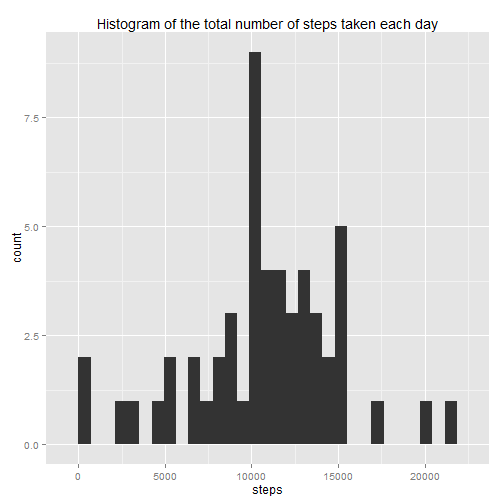
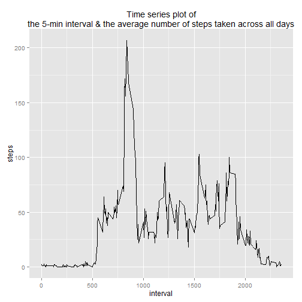
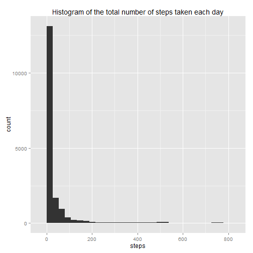
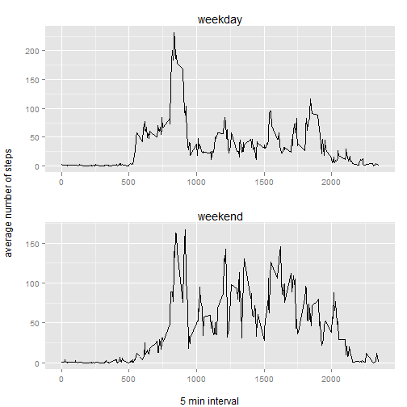

##Assignment

This assignment will be described in multiple parts. You will need to write a report that answers the questions detailed below. Ultimately, you will need to complete the entire assignment in a single R markdown document that can be processed by knitr and be transformed into an HTML file.

Throughout your report make sure you always include the code that you used to generate the output you present. When writing code chunks in the R markdown document, always use echo = TRUE so that someone else will be able to read the code. This assignment will be evaluated via peer assessment so it is essential that your peer evaluators be able to review the code for your analysis.

For the plotting aspects of this assignment, feel free to use any plotting system in R (i.e., base, lattice, ggplot2)

Fork/clone the GitHub repository created for this assignment. You will submit this assignment by pushing your completed files into your forked repository on GitHub. The assignment submission will consist of the URL to your GitHub repository and the SHA-1 commit ID for your repository state.

NOTE: The GitHub repository also contains the dataset for the assignment so you do not have to download the data separately.

###Loading and preprocessing the data

Show any code that is needed to

1. Load the data (i.e. read.csv())


```r
file = "./Coursera_5. Reproducible Research/repdata-data-activity/activity.CSV"
df <- read.csv(file, header = TRUE, stringsAsFactors = FALSE )
df <- df[,c(2,3,1)]
```

2. Process/transform the data (if necessary) into a format suitable for your analysis

```r
# Process / transform the data into a format suitable for analysis
## remove the NA values
cleandf <- na.omit(df)
## Convert the date columns from "characters" to "Date"
cleandf$date <- as.Date(cleandf$date, "%Y-%m-%d")
head(cleandf)
```

```
##           date interval steps
## 289 2012-10-02        0     0
## 290 2012-10-02        5     0
## 291 2012-10-02       10     0
## 292 2012-10-02       15     0
## 293 2012-10-02       20     0
## 294 2012-10-02       25     0
```

###What is mean total number of steps taken per day?

For this part of the assignment, you can ignore the missing values in the dataset.

1. Calculate the total number of steps taken per day

```r
totalStepDay <- aggregate(steps~date, cleandf, sum)
```
2. If you do not understand the difference between a histogram and a barplot, research the difference between them. Make a histogram of the total number of steps taken each day

```r
## create histogram of the totla number of steps taken each day
ggplot(totalStepDay, aes(steps))+geom_histogram() + 
    ggtitle("Histogram of the total number of steps taken each day")
```

```
## stat_bin: binwidth defaulted to range/30. Use 'binwidth = x' to adjust this.
```

 

3. Calculate and report the mean and median of the total number of steps taken per day

```r
## Calcuate the mean and median of the total number of steps taken per day
summary(totalStepDay)
```

```
##       date                steps      
##  Min.   :2012-10-02   Min.   :   41  
##  1st Qu.:2012-10-16   1st Qu.: 8841  
##  Median :2012-10-29   Median :10765  
##  Mean   :2012-10-30   Mean   :10766  
##  3rd Qu.:2012-11-16   3rd Qu.:13294  
##  Max.   :2012-11-29   Max.   :21194
```
###What is the average daily activity pattern?

1. Make a time series plot (i.e. type = "l") of the 5-minute interval (x-axis) and the average number of steps taken, averaged across all days (y-axis)

```r
# What is the average daily acitivy pattern?
meanStepInt <- ceiling(aggregate(steps~interval, cleandf, mean))
## Create a time series plot (x = interval, y = average number of steps)
ggplot(meanStepInt, aes(interval, steps)) + geom_line() + 
    ggtitle(paste("Time series plot of", 
                  "the 5-min interval & the average number of steps taken across all days", sep = "\n"))
```

 

2. Which 5-minute interval, on average across all the days in the dataset, contains the maximum number of steps?

```r
## Find which interval contains the maximum average number of steps?
filter(meanStepInt, steps == max(meanStepInt$steps))
```

```
##   interval steps
## 1      835   207
```
###Imputing missing values

Note that there are a number of days/intervals where there are missing values (coded as NA). The presence of missing days may introduce bias into some calculations or summaries of the data.

1. Calculate and report the total number of missing values in the dataset (i.e. the total number of rows with NAs)

```r
## Calculate the total number of missing values in the dataset
sum(is.na(df))
```

```
## [1] 2304
```

2. Devise a strategy for filling in all of the missing values in the dataset. The strategy does not need to be sophisticated. For example, you could use the mean/median for that day, or the mean for that 5-minute interval, etc.
3. Create a new dataset that is equal to the original dataset but with the missing data filled in.

```r
## Fill in the missing values with average number of steps during the interval.
index = meanStepInt$interval
filleddf <- df
for(i in index){
    filleddf$steps[filleddf$interval == i & is.na(filleddf$steps)] <- meanStepInt$steps[meanStepInt$interval == i]
}
filleddf$date <- as.Date(filleddf$date, "%Y-%m-%d")
head(filleddf)
```

```
##         date interval steps
## 1 2012-10-01        0     2
## 2 2012-10-01        5     1
## 3 2012-10-01       10     1
## 4 2012-10-01       15     1
## 5 2012-10-01       20     1
## 6 2012-10-01       25     3
```


4. Make a histogram of the total number of steps taken each day and Calculate and report the mean and median total number of steps taken per day. Do these values differ from the estimates from the first part of the assignment? What is the impact of imputing missing data on the estimates of the total daily number of steps?

```r
## create a histogram
totalStepDay2 <- aggregate(steps~date, filleddf, sum)
ggplot(filleddf, aes(steps)) + geom_histogram() + 
    ggtitle("Histogram of the total number of steps taken each day")
```

```
## stat_bin: binwidth defaulted to range/30. Use 'binwidth = x' to adjust this.
```

 

```r
## report the mean/median total number of steps taken per day
summary(filleddf)
```

```
##       date               interval          steps       
##  Min.   :2012-10-01   Min.   :   0.0   Min.   :  0.00  
##  1st Qu.:2012-10-16   1st Qu.: 588.8   1st Qu.:  0.00  
##  Median :2012-10-31   Median :1177.5   Median :  0.00  
##  Mean   :2012-10-31   Mean   :1177.5   Mean   : 37.45  
##  3rd Qu.:2012-11-15   3rd Qu.:1766.2   3rd Qu.: 27.00  
##  Max.   :2012-11-30   Max.   :2355.0   Max.   :806.00
```

###Are there differences in activity patterns between weekdays and weekends?

For this part the weekdays() function may be of some help here. Use the dataset with the filled-in missing values for this part.

1. Create a new factor variable in the dataset with two levels - "weekday" and "weekend" indicating whether a given date is a weekday or weekend day.

```r
filleddf$typeofDay <- weekdays(filleddf$date)
filleddf$typeofDay[filleddf$typeofDay %in% c("Saturday", "Sunday")] <- "weekend"
filleddf$typeofDay[filleddf$typeofDay != "weekend"] <- "weekday"
```

2. Make a panel plot containing a time series plot (i.e. type = "l") of the 5-minute interval (x-axis) and the average number of steps taken, averaged across all weekday days or weekend days (y-axis). See the README file in the GitHub repository to see an example of what this plot should look like using simulated data.

```r
meanStepInt2 <- aggregate(steps~interval+typeofDay, filleddf, mean)
meanStepInt2$steps <- ceiling(meanStepInt2$steps)

weekdayplot<- ggplot(filter(meanStepInt2, meanStepInt2$typeofDay =="weekday"), aes(interval, steps)) + 
    geom_line() + ggtitle("weekday") + theme(axis.title.x = element_blank(), axis.title.y = element_blank())
weekendplot<- ggplot(filter(meanStepInt2, meanStepInt2$typeofDay =="weekend"), aes(interval, steps)) + 
    geom_line() + ggtitle("weekend") + theme(axis.title.x = element_blank(), axis.title.y = element_blank())
grid.arrange(arrangeGrob(weekdayplot, weekendplot, nrow = 2), left = "average number of steps", bottom = "5 min interval")
```

 


